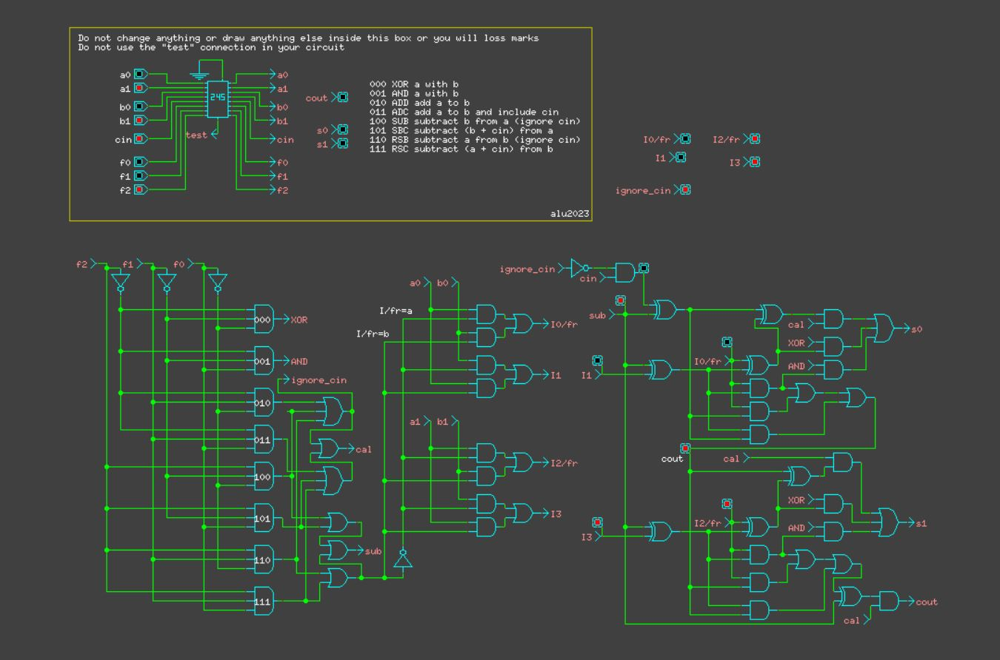

# A-basic-Arithmetic-Logic-Unit-ALU-
## Overview

This project involves designing a basic Arithmetic/Logic Unit (ALU) that operates on two 2-bit binary numbers `a` and `b` and generates a third 2-bit number `s`. The function of the ALU is determined by a 3-bit binary code `f`.

## ALU Functions

The ALU performs different operations based on the binary code `f`:

| `f2f1f0` | Name | Function |
|:--------:|:-----|:---------|
| 000      | XOR  | Logical Exclusive OR of `a` and `b` |
| 001      | AND  | Logical AND of `a` and `b` |
| 010      | ADD  | Add `a` to `b` (ignore `cin`) |
| 011      | ADC  | Add `a` to `b` and include `cin` |
| 100      | SUB  | Subtract `b` from `a` (ignore `cin`) |
| 101      | SBC  | Subtract (`b` + `cin`) from `a` |
| 110      | RSB  | Subtract `a` from `b` (ignore `cin`) |
| 111      | RSC  | Subtract (`a` + `cin`) from `b` |

- `a0` is the least significant bit of `a`.
- `a1` is the most significant bit.
- For operations that do not use the carry input, `cin` should be ignored.
- For operations that do not generate a carry (XOR, AND), the carry output `cout` should be zero.
- If a carry occurs as a result of an addition, or a borrow occurs as a result of a subtraction, `cout` should be 1.

## Sample

